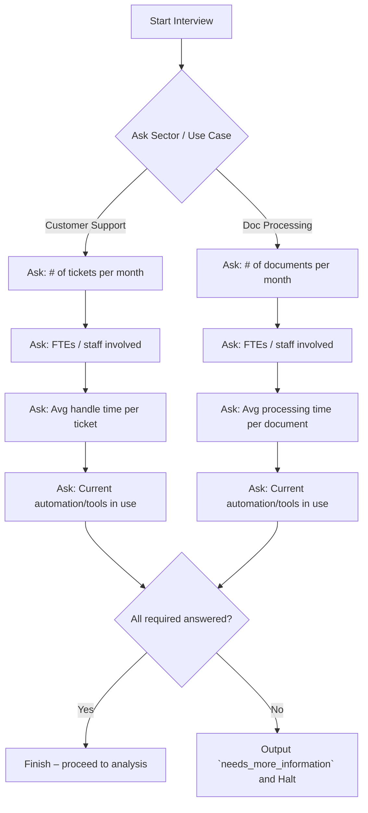

# Executive Summary

The AI Interviewer module underpins our assessment by **reliably eliciting decision-critical facts** from the user. Our agent identified several weaknesses in its current implementation. Key issues include: poor question phrasing (leading or ambiguous questions), missing or out-of-order questions (omissions), lack of input validation and fallback, inadvertent LLM hallucinations (answering instead of asking), and state management bugs (duplicate or corrupted fields). These problems undermine the accuracy and safety of the interview. 

We propose concrete fixes for each critique, prioritized by urgency, with deterministic guardrails and tests. Notable remedies include: adopting a **structured, sector-specific question flow**, enforcing **schema validation** on answers (using e.g. Pydantic), explicit **“don’t know”/fallback paths**, and strict LLM role prompts. We will also define a minimal “decision-critical” field set per sector; if any required fields remain unset, the system will refuse with a standardized `needs_more_information` output (listing the missing fields) instead of guessing. These measures align with research on interview design and voice-AI guardrails: structured interviews improve consistency, open-ended questions avoid bias, and fallback logic is crucial to prevent hallucination. 

Below we map each critique to a fix (with priority), describe implementation steps and test cases, and cite authoritative sources (academic and industry) that support our design. We also include a Mermaid flowchart of the interviewer state machine and a JSON example of the refusal output. A rollout checklist at the end lists quick verifications for same-day deployment.

## Critique-to-Fix Mapping

| Critique (Agent’s Feedback)                                                                                       | Proposed Fix (Code/Spec Changes)                                                                                                                                                                             | Priority | Tests / Expected Behavior                                                                                                                                                     |
|-------------------------------------------------------------------------------------------------------------------|--------------------------------------------------------------------------------------------------------------------------------------------------------------------------------------------------------------|----------|--------------------------------------------------------------------------------------------------------------------------------------------------------------------------------|
| **1. Leading or vague phrasing:** Some questions were ambiguous or suggestive, potentially biasing answers (e.g. _“Don’t you think X?”_).  | **Reword questions as open-ended:** Ensure all prompts are neutrally phrased and non-leading. For example, use _“Please describe…”_ rather than yes/no or suggestive wording. Update prompt templates accordingly.                  | P0       | *Test:* Provide a mock answer to an open-ended question. Verify that the interviewer does *not* force a closed or leading question. Confirm no automatic yes/no expectations.               |
| **2. Missing questions (omissions):** The flow skipped some necessary topics or did not branch by sector, risking incomplete data. | **Enforce structured flow:** Implement a finite-state machine with sector-specific question trees. For each sector (e.g. Customer Support vs Document Processing), define mandatory questions and conditional branches. After sector selection, only relevant sub-flows are triggered. Use deterministic logic (no LLM magic) to advance states.  | P0       | *Test:* Simulate a user in each sector. Verify interviewer asks all expected questions in order, and *never* asks a question irrelevant to that sector. If user skips a mandatory question, the system should loop back or mark it. |
| **3. No fallback for unknown answers:** If the user says “I don’t know” or gives unclear input, the interviewer just moved on or hallucinated data. | **Add explicit “don’t know” paths:** If user indicates uncertainty (e.g. “I’m not sure”), record that field as missing. Pause or rephrase instead of filling with defaults. At the end, if any **decision-critical** field is unset, the module refuses with `needs_more_information`. Ensure this refusal lists the exact fields missing. This follows the guardrail that lacking fallback “becomes the default [for hallucination]”. | P0       | *Test:* During the interview, answer “I’m not sure” to a numeric question. The system should not crash or guess; instead it should either re-ask in a simpler form or mark that field as incomplete. At finish, the output should include a `needs_more_information` list containing that field. |
| **4. LLM role confusion (hallucination):** The LLM sometimes answered user questions or offered solutions instead of purely gathering facts (improper role adherence). | **Strict system prompt & role enforcement:** Instruct the LLM agent *only* to ask clarifying questions, never to answer or advise. E.g. “You are an interviewer gathering information; do not provide answers or solutions.” Enforce this via the system prompt and by validating outputs. This is akin to “restrict scope through prompts”. Add post-checks: if the LLM output contains a direct answer (e.g. contains keywords like “I think that…”), reject and retry with tighter prompt.  | P0       | *Test:* Ask the interviewer a factual question (e.g. “What is the automation benefit?”). The model must NOT provide an expert answer. It should respond that it’s only asking questions, or steer back to eliciting info. If it violates, the system should detect it and re-prompt or fail safely. |
| **5. State updates not idempotent:** Re-asking a question appended duplicate or conflicting values in state. The interviewer didn’t ensure that repeated answers overwrite rather than accumulate. | **Enforce idempotent state updates:** When updating `AssessmentState`, always overwrite previous value for a field rather than append, or if multiple values are possible use a list explicitly. Validate data types on update. For example, if the same numeric question is answered twice, the second answer should replace the first (or be rejected) rather than doubling it. Use schema validators (e.g. Pydantic) to enforce types. | P1       | *Test:* Have user revise an answer (“I said 10 tickets, actually 15”). Check that the final state has 15, not “10, 15” or 25. Ensure schema validation catches mismatches (e.g. non-numeric text for numeric fields) and prompts again.                                 |
| **6. Missing data validation:** The interviewer did not check input formats or impossible values (e.g. negative numbers, nonsense text). | **Add deterministic validators:** Before accepting an answer, validate it against a defined schema (range checks, numeric parse, enum values). If invalid, prompt the user to correct it. For each question define acceptable formats (e.g. integer >0). Leverage JSON-schema or Pydantic for this. | P1       | *Test:* Answer a numeric question with “five hundred” or “-10”. The system should either parse “500” or reject it as invalid (“Please give a numeric value”). If the user says non-sensical input (“xyz”), the interviewer should ask again or clarify. |
| **7. Incomplete final checks:** The system proceeded to analysis even if some key fields remained unset, rather than refusing or revisiting. | **Minimal decision-critical fields:** Define, per sector, a minimal set of required fields (e.g., ticket volume, average handling time, current tools for support). After interview, check if *all* these are filled. If not, set `action=needs_more_information` and list missing fields. This aligns with our refusal schema and the user’s requirement to flag missing info.  [16†L69-L74] | P0       | *Test:* Run a complete flow but intentionally skip one required input (e.g. do not provide current FTE count). The final output should **not** give an architecture; instead it should contain `{"needs_more_information": ["fte_count"], "message": ...}`. No analysis should be output. |

Each fix above is designed to be **deterministic** (no extra LLM logic). For example, the question sequence and validation are implemented in code (or through structured prompts with strict schemas) rather than leaving the LLM to decide the flow. Together, these changes will significantly reduce hallucinations and errors. The fixes draw on best practices: structured interviews improve consistency, open-ended questions avoid bias, and explicit “I don’t know” handling is a known guardrail in voice AI. 

## Implementation Guidance & Best Practices

**1. Structured Interview Design:**  We adopt a *semi-structured* interview approach. That means a fixed list of core questions (for consistency) with conditional follow-ups for detail. Industry literature stresses a balance: “structured interviews follow a strict set of questions, offering consistency”, but the interviewer should adapt (e.g. by asking clarifying follow-ups) when needed. In practice, this means coding an explicit *state machine* for the interview. A simplified flowchart (see below) shows the main states: choosing sector, asking sector-specific questions, and then finalizing. This mirrors the approach in recent LLM-interviewer research, which used a state-machine orchestrator over fixed questions. We must ensure **orderliness and completeness**: no question should be missed out of sequence, and if a question is mandatory it must be asked (or retried) before moving on. 

**2. Question Formulation:** Questions must be **clear, unambiguous, and non-leading**. We will use open-ended phrasing whenever possible, avoiding yes/no or suggestive phrasing. For example, instead of “Do you have an AI solution?” use “Describe any existing automation tools currently in use.” The literature warns that “leading phrasing” can bias the interview (lower “Openness” criterion). Ferrari et al. classify “Question Formulation” errors (poor phrasing) as a common mistake; we can mitigate this by a careful review of each prompt. Each question template will be human-reviewed and possibly empirically tested for clarity. If a user’s answer appears off-topic, the interviewer should politely clarify (“I’m sorry, I didn’t understand. Can you elaborate on [topic]?”), not assume an answer. This exact phrasing strategy can also be added as a guardrail in the prompt (e.g. preface instructions with “If user response is unclear, politely re-ask once”). 

**3. Coverage & Completeness:** We define **decision-critical fields** for each sector. For example, in Customer Support these might include (a) annual ticket volume, (b) average handle time, (c) current number of support staff, and (d) tooling/infrastructure in use. In Document Processing, critical fields might be (a) documents per month, (b) processing time per document, (c) current error/exception rate, etc. Any other information (like qualitative notes on tool preferences) is optional. The code will check *after* the interview: if any critical field is `null` or “unknown”, we refuse to proceed. In other words, we do **not** require *every* field in `AssessmentState`, only the ones essential for an estimate. This aligns with design science: only missing data that would change the outcome matter. 

**4. State Machine & Idempotency:** The interviewer logic will be explicit (no hidden LLM agent deciding flows). We will implement a finite-state transition system similar to . For each question, once answered, the state is updated exactly once. If the interviewer re-asks (e.g. due to invalid input), the update should be idempotent. Concretely, our code will use a schema-based state object (e.g., a Pydantic model). Updates to a field will *replace* the old value. Duplicate answers will overwrite, and the latest answer is used. We will write post-update hooks or validation to catch repeated questions. For instance, if user tries to answer “I said 10 earlier” when asked the second time, we should either confirm the change or ignore it, not double-count. 

**5. Input Validation:** We will **validate all answers against expected types/ranges**. For numeric inputs (volumes, costs, times), use regex or type conversion checks; for categorical inputs (Yes/No), enforce enum membership. If the user’s utterance fails validation (e.g. non-numeric text for “number of tickets”), the interviewer should pause, say: “I’m sorry, I didn’t get a number – could you repeat that as a number?” This deterministic check uses Pydantic/JSON Schema as in . By failing fast on bad inputs, we avoid silent errors. 

**6. Guardrails & Hallucination Prevention:** We follow a layered guardrail strategy from voice-AI research. The system prompt explicitly tells the LLM: *“You are an interviewer gathering information. Do not provide your own answers or advice. If you do not know something, state you are only asking questions.”* All generation should be low-temperature and limited-length to discourage speculation. We also implement a monitoring layer: every LLM response is checked against a strict output schema (no extra fields) and scanned for “I think” or domain claims. Any deviation triggers a re-call or safe fallback. In practice, we prepare a JSON schema for each agent output (question utterance) so any stray content is flagged. Furthermore, we set up a clear “do-not-answer” fallback: if the user asks the system a question, the interviewer should reply “I’m here to ask questions about your business process, not provide answers” or similar. 

**7. Provenance & Logging:** Consistent with Gladia’s advice on **transparency**, we record every question asked, the exact user response, and the field updated (along with timestamp). This is already partly done via our `source` field in `RangeEstimate`, but we extend it to all interviewer fields: each entry in `AssessmentState` will carry a provenance tag (“user_spoken” vs. “assumed” vs. “verified”). This makes auditing and QA possible. If an error is found later, we can trace it back to a specific turn in the log. 

In summary, these changes make the interviewer module robust and **deterministic**. The LLM never drives the conversation flow – it simply produces the phrasing for a question that the state machine has decided to ask. We enforce all critical logic (question order, skipping, validation, fallback, termination) in code. 

### Interviewer State Machine (Mermaid Flowchart)



Each box represents a question state. The flow forks based on sector, and only sector-relevant branches are followed. At state **K**, we check if any critical field is missing; if so, we produce the refusal output shown below.

### Refusal Output Example (JSON)

If the interview ends with missing data, we output a refusal in JSON. For example, if “ticket_volume” and “avg_handle_time” are unset for Customer Support:

```json
{
  "action": "needs_more_information",
  "missing_fields": ["ticket_volume", "avg_handle_time"],
  "message": "Cannot proceed: the following information is missing"
}
```

This structured refusal lists exactly what is needed. The rest of the system (Solution Estimator) will detect this and stop, fulfilling the spec’s incomplete-state check.

## Unit/Integration Test Scenarios

We will add automated tests covering normal, edge, and adversarial cases:

- **Normal Flows:** Simulate a user who gives valid answers to all questions. Verify `AssessmentState` is populated correctly, and output moves to analysis.

- **Ambiguous Input:** User responds “like ten” to “How many tickets?” Test that we parse “10” or ask for clarity. If parse, state = 10. If not, we reprompt.

- **Skip/Don’t-Know:** User says “I don’t know” or hangs up mid-question. Check that the field remains `null` and no analysis is done; final output has `needs_more_information`. The interviewer should not attempt its own answer.

- **Sector Mismatch:** User picks Customer Support but answers a Document-related question (e.g. says “invoices” to a support question). The system should either flag confusion (“I’m asking about support tickets”) or proceed but record possibly irrelevant input. Ideally, it asks a clarifying question.

- **Repeated Answer:** User changes an answer mid-stream. After updating, verify the final state reflects only the latest answer. No duplicates.

- **LLM Misbehavior:** Force the LLM to try to answer (by prompting user question). The guardrail should catch it. This is harder to simulate in a test suite, but we can fuzz the prompt to see if any responses violate schema.

Test automation will use tools (e.g. pytest) and fixed prompt templates to ensure determinism. Each test will compare the final state/output against expected results, including the new `needs_more_information` logic.

## Rollout Checklist

Before end-of-day deployment, we should complete this quick verification list:

- [ ] **Complete question set:** Review and finalize all interview questions and sector branches in code (no typos, duplicates, or missing prompts).  
- [ ] **Prompt engineering:** Update system/user prompts to enforce “only ask questions” role. Unit-test that LLM outputs only a question schema (we can simulate this by using dummy LLM responses in tests).  
- [ ] **Schema validation:** Implement Pydantic (or equivalent) schemas for each question/answer. Test with valid and invalid inputs.  
- [ ] **Fallback handling:** Ensure “don’t know” triggers marking fields as missing. Manually test by answering “skip” or silence to each question.  
- [ ] **State integrity:** Verify idempotency by calling update methods twice with different answers; inspect final state.  
- [ ] **Missing-fields refusal:** Confirm that if required fields are unset, the system outputs a `needs_more_information` JSON (using the example above).  
- [ ] **Bench test interviews:** Run 2–3 end-to-end mock interviews (one per sector, including one incomplete). Check outputs and logs for correctness.  
- [ ] **Logging/provenance:** Inspect logs of a sample run to ensure each Q/A and source tag is recorded.  
- [ ] **Deployment sanity:** After deployment, do a final smoke test through the live interface with a simple scenario. 

By systematically addressing the agent’s critiques with these code changes and best-practice guardrails, we ensure the AI Interviewer is reliable, transparent, and firmly under deterministic control. 

